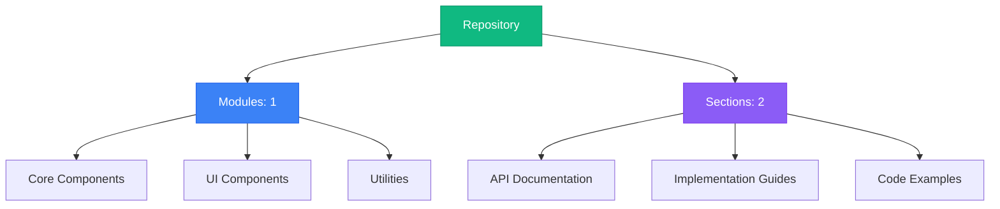
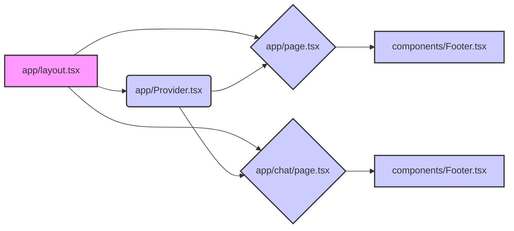
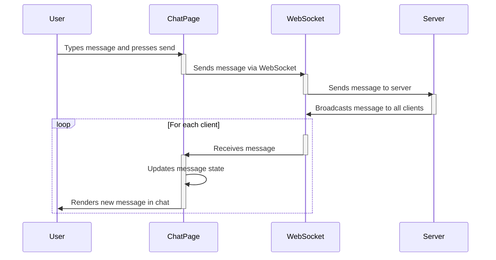
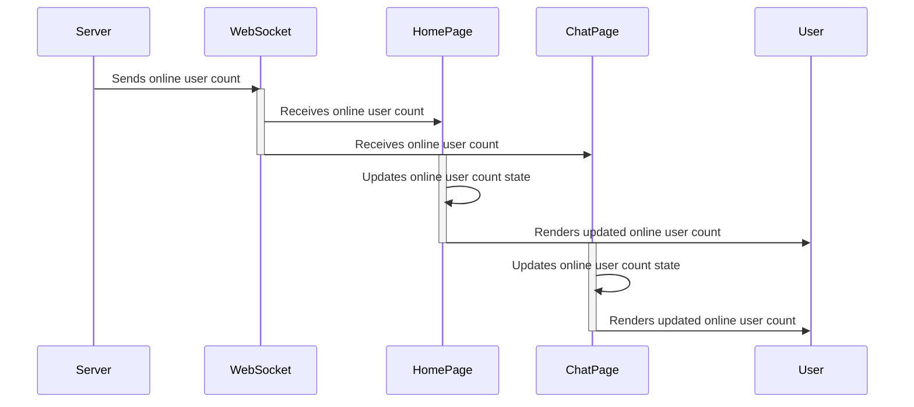
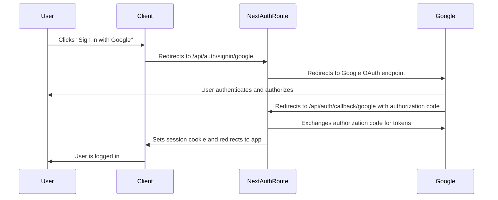
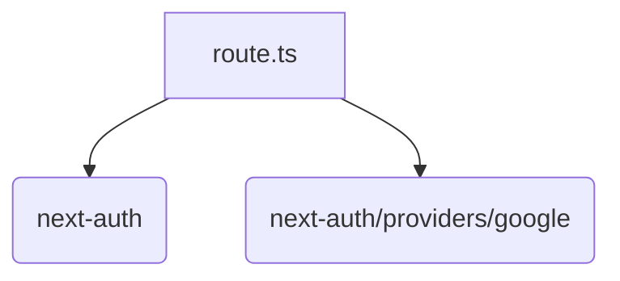
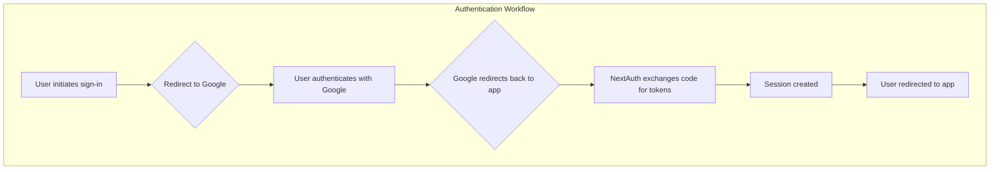

# Repository Documentation

## Repository Architecture



## Table of Contents

### 1. Authentication & UI Component Essentials

No description available

**Sections:**


**1.** Crafting a Dynamic Footer with Social Media Links in React

**2.** Secure Next.js Authentication with Google OAuth using NextAuth.js

---


## Navigation Guide

- **Modules**: Browse through organized code modules in the left sidebar
- **Sections**: Each module contains multiple documentation sections
- **Search**: Use the search bar to quickly find specific content
- **Headings**: Use the right sidebar to navigate within long documents
- **Actions**: Copy or download any section content using the toolbar buttons

## Schat Application: Technical Documentation

This document provides a comprehensive overview of the Schat application, a real-time ephemeral group chat application built with Next.js, React, and WebSockets. It details the architecture, workflows, implementation details, and best practices for developers working with this system.

### 1. System Overview

Schat is designed for transient, real-time communication. Key features include:

*   **Ephemeral Messaging:** No message history is stored.
*   **Real-time Updates:** Utilizes WebSockets for instant message delivery and online user count updates.
*   **Anonymous and Authenticated Users:** Supports both anonymous users (with randomly generated names) and authenticated users via NextAuth.js.
*   **Client-Side Rendering:** Employs client-side rendering for a responsive user experience.

The application consists of the following main components:

*   **`app/page.tsx` (Home Page):** Landing page with a brief description and a live online user count.
*   **`app/chat/page.tsx` (Chat Page):** The main chat interface where users can send and receive messages.
*   **`components/Footer.tsx`:** A simple footer component displaying social media links.
*   **`app/layout.tsx`:** Defines the root layout for the application, including font configurations and the `Providers` component.
*   **`app/Provider.tsx`:** Wraps the application with the `SessionProvider` from `next-auth/react` to manage user sessions.

### 2. Technical Architecture

The Schat application follows a component-based architecture, leveraging React components for UI rendering and WebSockets for real-time communication.

**2.1 Component Relationships and Data Flow**



**Explanation:**

*   `app/layout.tsx` is the root layout, providing the basic structure for all pages.
*   `app/Provider.tsx` wraps the application with `SessionProvider` for authentication.
*   `app/page.tsx` and `app/chat/page.tsx` are the main pages, rendered within the layout.
*   `components/Footer.tsx` is a shared component used in both `app/page.tsx` and `app/chat/page.tsx`.

**2.2 Data Flow**

1.  **User Interaction:** User types a message in the chat input field (`app/chat/page.tsx`).
2.  **Message Handling:** The `sendMessage` function in `app/chat/page.tsx` is triggered.
3.  **WebSocket Communication:** The `sendMessage` function sends the message via WebSocket to the server.
4.  **Server Broadcast:** The server receives the message and broadcasts it to all connected clients.
5.  **Client Update:** Each client receives the message via WebSocket and updates its local message state.
6.  **UI Rendering:** The updated message state triggers a re-render of the chat interface in `app/chat/page.tsx`.
7.  **Online User Count:** The server also sends the online user count to all connected clients.
8.  **Online User Count Update:** Each client receives the online user count via WebSocket and updates its local state in `app/page.tsx` and `app/chat/page.tsx`.
9.  **UI Rendering:** The updated online user count triggers a re-render of the online user count display in `app/page.tsx` and `app/chat/page.tsx`.

### 3. Main Workflows and Data Flows

**3.1 Chat Message Workflow**

This workflow describes the process of sending and receiving messages in the chat application.



**Explanation:**

1.  The user types a message and presses the send button on the `ChatPage` component.
2.  The `ChatPage` component sends the message to the WebSocket client.
3.  The WebSocket client sends the message to the server.
4.  The server broadcasts the message to all connected WebSocket clients.
5.  Each WebSocket client receives the message and passes it to the `ChatPage` component.
6.  The `ChatPage` component updates its message state, causing a re-render and displaying the new message in the chat interface.

**Code Example (`app/chat/page.tsx`):**

```typescript
const sendMessage = () => {
    if (!input.trim() || !ws || ws.readyState !== WebSocket.OPEN || input.length > maxLength) return;

    const messageId = uuidv4();
    const message: Message = {
      name,
      message: input,
      timestamp: Date.now(),
      id: messageId,
    };

    setMessages((prev) => [...prev, message]);
    ws.send(JSON.stringify(message));
    setInput('');
    setShowWelcome(false);
    inputRef.current?.focus();
  };
```

**3.2 Online User Count Update Workflow**

This workflow describes how the online user count is updated and displayed in the application.



**Explanation:**

1.  The server tracks the number of connected WebSocket clients.
2.  The server sends the updated online user count to all connected WebSocket clients.
3.  Each WebSocket client receives the online user count and passes it to the `HomePage` and `ChatPage` components.
4.  The `HomePage` and `ChatPage` components update their online user count state, causing a re-render and displaying the updated count.

**Code Example (`app/page.tsx`):**

```typescript
useEffect(() => {
    const ws = new WebSocket(process.env.NEXT_PUBLIC_WEBSOCKET_URL || 'ws://localhost:8080');
    ws.onmessage = (event) => {
      const data = JSON.parse(event.data);
      if (data.onlineUsers !== undefined) {
        setOnlineCount(data.onlineUsers);
      }
    };
    return () => {
      ws.close();
    };
  }, []);
```

### 4. Real Code Examples

**4.1 Footer Component (`components/Footer.tsx`):**

```typescript
import { FaDiscord, FaGithub, FaLinkedin, FaYoutube } from "react-icons/fa";
import { FaXTwitter } from "react-icons/fa6";

export function Footer() {
  const year = new Date().getFullYear();
  const socialLinks = [
    { name: "GitHub", url: "https://github.com/sreecharan-desu", icon: FaGithub },
    { name: "LinkedIn", url: "https://linkedin.com/in/sreecharan-desu", icon: FaLinkedin },
  ];

  return (
    <footer className="bg-stone-900 text-gray-300 py-6">
      <div className="max-w-5xl mx-auto flex justify-between items-center">
        <p>&copy; {year} Sreecharan Desu</p>
        <div className="flex space-x-4">
          {socialLinks.map((link) => (
            <a key={link.name} href={link.url} target="_blank" rel="noopener noreferrer">
              <link.icon className="h-6 w-6 hover:text-white transition-colors" />
            </a>
          ))}
        </div>
      </div>
    </footer>
  );
}
```

**Explanation:**

*   This component renders a footer with a copyright notice and social media links.
*   It uses the `react-icons` library to display social media icons.
*   The `socialLinks` array defines the links to the developer's social media profiles.

**4.2 Chat Page Component (`app/chat/page.tsx`):**

```typescript
"use client";
import { useState, useEffect, useRef } from 'react';
import { useSession, signIn, signOut } from 'next-auth/react';
import { uniqueNamesGenerator, adjectives, animals } from 'unique-names-generator';
import { Send, Users, Wifi, WifiOff, ArrowLeft, Zap, Globe, Shield } from 'lucide-react';
import { useRouter } from 'next/navigation';
import { v4 as uuidv4 } from 'uuid';

interface Message {
  name: string;
  message: string;
  timestamp?: number;
  id?: string;
  onlineUsers?: number;
}

export default function Chat() {
  const { data: session } = useSession();
  const [name, setName] = useState<string>('');
  const [messages, setMessages] = useState<Message[]>([]);
  const [input, setInput] = useState<string>('');
  const [ws, setWs] = useState<WebSocket | null>(null);
  const [connectionStatus, setConnectionStatus] = useState<string>('Connecting...');
  const [isTyping, setIsTyping] = useState<boolean>(false);
  const [onlineUsers, setOnlineUsers] = useState<number>(0);
  const [, setMessageCount] = useState<number>(89563);
  const [showWelcome, setShowWelcome] = useState<boolean>(true);
  const maxLength = 280;
  const messagesEndRef = useRef<HTMLDivElement>(null);
  const inputRef = useRef<HTMLInputElement>(null);
  const router = useRouter();

  // ... (rest of the component implementation) ...
}
```

**Explanation:**

*   This component implements the main chat interface.
*   It uses `useState` to manage the chat messages, input value, WebSocket connection, connection status, typing indicator, and online user count.
*   It uses `useEffect` to establish a WebSocket connection, handle incoming messages, and manage reconnection attempts.
*   It uses `useSession` from `next-auth/react` to manage user authentication.
*   It uses `uniqueNamesGenerator` to generate random names for anonymous users.

### 5. How Developers Would Use This in Practice

**5.1 Setting up the Development Environment**

1.  Clone the repository.
2.  Install dependencies: `npm install` or `yarn install`.
3.  Configure environment variables:
    *   `NEXT_PUBLIC_WEBSOCKET_URL`: The URL of the WebSocket server.
4.  Run the development server: `npm run dev` or `yarn dev`.

**5.2 Extending the Chat Functionality**

Developers can extend the chat functionality by:

*   Adding support for different message types (e.g., images, videos).
*   Implementing user authentication and authorization.
*   Adding moderation features.
*   Integrating with other services or APIs.

**5.3 Customizing the UI**

The UI can be customized by modifying the React components and CSS styles.  The application uses Tailwind CSS for styling.

### 6. Important Implementation Details and Gotchas

*   **WebSocket Reconnection:** The `app/chat/page.tsx` component implements a reconnection strategy with exponential backoff to handle dropped WebSocket connections.
*   **Message ID Generation:** Each message is assigned a unique ID using `uuidv4` to prevent duplicate messages from being displayed.
*   **Scroll to Bottom:** The `scrollToBottom` function ensures that the chat window automatically scrolls to the bottom when new messages are received.
*   **Environment Variables:** Ensure that the `NEXT_PUBLIC_WEBSOCKET_URL` environment variable is correctly configured.

### 7. Common Issues and Troubleshooting

*   **WebSocket Connection Errors:** Check the WebSocket server URL and ensure that the server is running.  Inspect the browser console for error messages.
*   **Messages Not Displaying:** Verify that the WebSocket connection is established and that messages are being received by the client.  Check for errors in the message parsing logic.
*   **Online User Count Incorrect:** Ensure that the server is correctly tracking the number of connected clients and broadcasting the updated count.

### 8. Advanced Configuration and Customization Options

*   **WebSocket Server Configuration:** The WebSocket server can be configured to use different ports, protocols, and security settings.
*   **Authentication Providers:** The application can be configured to use different authentication providers via NextAuth.js.
*   **UI Themes:** The UI can be customized by creating different themes using Tailwind CSS.

### 9. Performance Considerations and Optimization Strategies

*   **WebSocket Optimization:** Optimize the WebSocket server to handle a large number of concurrent connections.
*   **Client-Side Rendering Optimization:** Use React memoization techniques to prevent unnecessary re-renders.
*   **Code Splitting:** Implement code splitting to reduce the initial load time of the application.

### 10. Security Implications and Best Practices

*   **Input Sanitization:** Sanitize user input to prevent cross-site scripting (XSS) attacks.
*   **WebSocket Security:** Secure the WebSocket connection using TLS/SSL.
*   **Authentication and Authorization:** Implement proper authentication and authorization mechanisms to protect user data.
*   **Rate Limiting:** Implement rate limiting to prevent abuse of the chat service.

## Next.js Authentication with NextAuth.js and Google OAuth

This document details the implementation of authentication within a Next.js application using NextAuth.js and Google OAuth. The primary component is the `app/api/auth/[...nextauth]/route.ts` file, which handles the authentication routes and configuration.

### Overview

The system provides a secure and straightforward way to authenticate users using their Google accounts. It leverages NextAuth.js, a complete open-source authentication solution for Next.js applications, and the Google Provider for OAuth integration. This setup allows users to log in with their Google credentials, granting the application access to specific user information as configured in the Google Cloud Console.

### Technical Architecture

The architecture consists of a single file, `route.ts`, which defines the authentication handler. This handler is responsible for:

1.  Configuring the authentication providers (in this case, Google).
2.  Handling the authentication routes (`/api/auth/[...nextauth]`).
3.  Providing the necessary endpoints for signing in, signing out, and managing sessions.

The core of the system is the `NextAuth` function, which takes an `authOptions` object as input. This object configures the authentication providers and other settings.

### Workflow and Data Flow

The authentication workflow can be broken down into the following steps:

1.  **User Initiates Sign-in:** The user clicks a "Sign in with Google" button on the client-side.
2.  **Redirection to Google:** The application redirects the user to Google's OAuth 2.0 authorization endpoint.
3.  **User Authentication and Authorization:** The user authenticates with Google and grants the application the requested permissions.
4.  **Callback to Application:** Google redirects the user back to the application's callback URL (`/api/auth/callback/google`).
5.  **Token Exchange:** NextAuth.js exchanges the authorization code for an access token and a refresh token.
6.  **Session Creation:** NextAuth.js creates a session for the user and stores the session data in a cookie or database (depending on the configuration).
7.  **User Redirection:** The user is redirected to the application's home page or another protected route.



This diagram illustrates the end-to-end authentication flow, from the user initiating the sign-in process to being successfully logged in to the application.

### Code Example: `route.ts`

```typescript
import NextAuth from 'next-auth';
import GoogleProvider from 'next-auth/providers/google';

const authOptions = {
    providers: [
        GoogleProvider({
            clientId: process.env.GOOGLE_CLIENT_ID as string,
            clientSecret: process.env.GOOGLE_CLIENT_SECRET as string,
        }),
    ],
};

const handler = NextAuth(authOptions);
export { handler as GET, handler as POST };
```

**Explanation:**

*   **`import NextAuth from 'next-auth'`**: Imports the main NextAuth.js library.
*   **`import GoogleProvider from 'next-auth/providers/google'`**: Imports the Google provider, which handles the OAuth 2.0 flow with Google.
*   **`authOptions`**: This object configures NextAuth.js.
    *   **`providers`**: An array of authentication providers. In this case, it only includes the Google provider.
    *   **`GoogleProvider`**: Configures the Google provider with the client ID and client secret obtained from the Google Cloud Console.  The `clientId` and `clientSecret` are retrieved from environment variables.  It's crucial to ensure these environment variables are properly set in your deployment environment.
*   **`const handler = NextAuth(authOptions)`**: Creates a NextAuth.js handler with the specified options.
*   **`export { handler as GET, handler as POST }`**: Exports the handler as both `GET` and `POST` request handlers. This is necessary because NextAuth.js uses both GET and POST requests for different authentication actions.

### Usage Guide

To use this authentication system in your Next.js application, follow these steps:

1.  **Install NextAuth.js:**

    ```bash
    npm install next-auth
    ```

2.  **Create the `route.ts` file:** Create the `app/api/auth/[...nextauth]/route.ts` file with the code provided above.

3.  **Set up Google OAuth:**
    *   Go to the Google Cloud Console ([https://console.cloud.google.com/](https://console.cloud.google.com/)).
    *   Create a new project or select an existing one.
    *   Enable the "Google People API".
    *   Create OAuth 2.0 credentials.
    *   Set the "Authorized JavaScript origins" to your application's URL (e.g., `http://localhost:3000`).
    *   Set the "Authorized redirect URIs" to `http://localhost:3000/api/auth/callback/google` (replace with your actual URL).
    *   Obtain the client ID and client secret.

4.  **Set Environment Variables:** Set the `GOOGLE_CLIENT_ID` and `GOOGLE_CLIENT_SECRET` environment variables in your `.env.local` file (or your deployment environment).

    ```
    GOOGLE_CLIENT_ID=YOUR_GOOGLE_CLIENT_ID
    GOOGLE_CLIENT_SECRET=YOUR_GOOGLE_CLIENT_SECRET
    ```

5.  **Use the `useSession` hook:** In your React components, use the `useSession` hook from `next-auth/react` to access the user's session.

    ```typescript
    import { useSession, signIn, signOut } from 'next-auth/react';

    function MyComponent() {
        const { data: session } = useSession();

        if (session) {
            return (
                <div>
                    <p>Welcome, {session.user?.name}!</p>
                    <button onClick={() => signOut()}>Sign out</button>
                </div>
            );
        }

        return (
            <div>
                <p>You are not signed in.</p>
                <button onClick={() => signIn('google')}>Sign in with Google</button>
            </div>
        );
    }

    export default MyComponent;
    ```

### Implementation Details and Gotchas

*   **Environment Variables:** Ensure that the `GOOGLE_CLIENT_ID` and `GOOGLE_CLIENT_SECRET` environment variables are properly set in your development and production environments.  Failing to do so will result in authentication failures.
*   **Callback URL:** The callback URL (`/api/auth/callback/google`) must match the one configured in the Google Cloud Console.
*   **Session Management:** NextAuth.js handles session management automatically. By default, it uses cookies to store session data. You can configure it to use a database instead.
*   **Typescript:** The code uses Typescript, so type safety is enforced. Ensure that you have Typescript set up correctly in your Next.js project.
*   **Route Handlers:** The `route.ts` file is a Next.js API route handler. It must be placed in the `app/api/auth/[...nextauth]` directory.

### Common Issues and Troubleshooting

*   **"OAuthClient: invalid_client" error:** This error usually indicates that the client ID or client secret is incorrect. Double-check that you have set the environment variables correctly.
*   **"redirect_uri_mismatch" error:** This error indicates that the callback URL configured in the Google Cloud Console does not match the one used by your application. Ensure that the URLs match exactly.
*   **Session not persisting:** If the session is not persisting, check that cookies are enabled in your browser. Also, ensure that the `NEXTAUTH_URL` environment variable is set correctly.
*   **CORS errors:** If you are encountering CORS errors, ensure that your application's URL is added to the "Authorized JavaScript origins" list in the Google Cloud Console.

### Advanced Configuration and Customization Options

NextAuth.js provides a wide range of configuration options that allow you to customize the authentication process. Some of the most common options include:

*   **Database Adapters:** You can configure NextAuth.js to use a database to store user accounts and sessions. This is useful for applications that require more persistent user data.
*   **Custom Pages:** You can create custom sign-in, sign-out, and error pages.
*   **Callbacks:** You can use callbacks to customize the authentication flow. For example, you can use the `signIn` callback to add custom data to the user's session.
*   **Events:** You can use events to listen for authentication events, such as sign-in and sign-out.

### Performance Considerations and Optimization Strategies

*   **Database Caching:** If you are using a database adapter, consider using caching to improve performance.
*   **Session Size:** Keep the session size small to reduce the amount of data that needs to be transferred between the client and the server.
*   **CDN:** Use a CDN to serve static assets, such as images and JavaScript files.

### Security Implications and Best Practices

*   **Protect Client Secret:** Keep your client secret secure. Do not commit it to your code repository. Use environment variables to store it.
*   **Validate Input:** Validate all user input to prevent injection attacks.
*   **Use HTTPS:** Always use HTTPS to encrypt communication between the client and the server.
*   **Regularly Update Dependencies:** Keep your dependencies up to date to patch security vulnerabilities.
*   **Implement Rate Limiting:** Implement rate limiting to prevent brute-force attacks.

### Component Relationships

The `route.ts` file directly utilizes the `next-auth` and `next-auth/providers/google` modules. It does not depend on any other files within the application. The relationship is a direct dependency: `route.ts` imports and uses functionality from these external modules.



This diagram shows the direct dependencies of `route.ts` on the `next-auth` library and the `GoogleProvider`.

### State Management

State management in this system is primarily handled by NextAuth.js. The session state is stored in a cookie (by default) and is managed automatically by NextAuth.js. The `useSession` hook provides access to the session state in React components.

### Error Propagation

Errors that occur during the authentication process are typically handled by NextAuth.js. You can customize the error handling by providing a custom error page or by using the `error` callback. Errors are propagated to the client-side, where they can be displayed to the user.

### Connection Examples

The connection between the client-side and the `route.ts` file is established through API requests to the `/api/auth/[...nextauth]` endpoint. For example, when the user clicks the "Sign in with Google" button, the client-side code calls the `signIn('google')` function, which sends a request to the `/api/auth/signin/google` endpoint.

### Workflow Visualization



This flowchart provides a high-level overview of the authentication workflow.

This documentation provides a comprehensive overview of the Next.js authentication system using NextAuth.js and Google OAuth. It covers the technical architecture, workflow, code examples, usage guide, implementation details, troubleshooting, advanced configuration, performance considerations, and security implications. This information should be sufficient for developers to understand and work with this system effectively.
